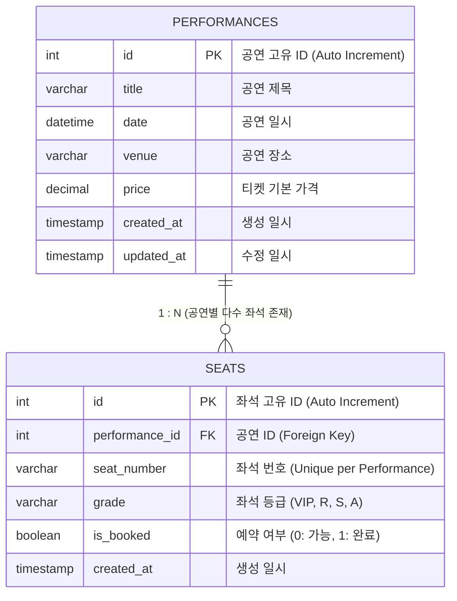

# 🛢️ Database 최종과제 - 티켓 예매 시스템 설계

본 프로젝트는 공연 티켓 예매 시스템의 데이터베이스를 직접 설계하고, 비즈니스 요구사항에 부합하는 SQL 쿼리를 작성하여 검증하기 위한 데이터베이스 설계 패키지입니다. 본 설계와 스키마는 향후 Node.js 기반 백엔드 애플리케이션 개발 시 그대로 이어서 연동할 수 있도록 업계 표준 무결성 제약조건을 준수하여 작성되었습니다.

---

## 📌 1. 데이터베이스 ERD (Entity Relationship Diagram)

아래 다이어그램은 **공연(performances)**과 **좌석(seats)** 간의 **1:N (일대다) 관계**를 도식화한 ERD입니다.



> [!NOTE]  
> `performances` 테이블의 기본키(`id`)는 `seats` 테이블의 `performance_id` 외래키로 참조됩니다. 
> 공연이 취소되거나 삭제될 경우 해당 공연의 좌석 정보들도 자동으로 정리되도록 **`ON DELETE CASCADE`** 무결성 옵션이 적용되어 있습니다.

---

## 📋 2. 테이블 상세 명세 (Schema Specification)

### 2.1 `performances` (공연 정보 테이블)
| 컬럼명 | 데이터 타입 | Null 여부 | Key | 기본값 | 설명 |
| :--- | :--- | :--- | :---: | :--- | :--- |
| **id** | INT | NOT NULL | PK | *Auto Increment* | 공연의 고유 식별값 |
| **title** | VARCHAR(100) | NOT NULL | | | 공연의 제목 (예: 아이유 콘서트) |
| **date** | DATETIME | NOT NULL | | | 공연 시작 일시 |
| **venue** | VARCHAR(100) | NOT NULL | | | 공연이 진행되는 장소 |
| **price** | DECIMAL(10,2) | NOT NULL | | | 티켓의 기본 원화/달러 가격 |
| **created_at**| TIMESTAMP | DEFAULT | | CURRENT_TIMESTAMP | 레코드 생성 일시 |
| **updated_at**| TIMESTAMP | DEFAULT | | ON UPDATE CURRENT_TIMESTAMP | 레코드 수정 일시 |

### 2.2 `seats` (공연별 좌석 정보 테이블)
| 컬럼명 | 데이터 타입 | Null 여부 | Key | 기본값 | 설명 |
| :--- | :--- | :--- | :---: | :--- | :--- |
| **id** | INT | NOT NULL | PK | *Auto Increment* | 좌석의 고유 식별값 |
| **performance_id** | INT | NOT NULL | FK | | `performances.id` 참조 외래키 |
| **seat_number** | VARCHAR(20) | NOT NULL | UK | | 좌석 번호 (예: A-1, VIP-01) |
| **grade** | VARCHAR(10) | NOT NULL | | | 좌석 등급 (VIP, R, S, A) |
| **is_booked** | BOOLEAN | NOT NULL | | FALSE (0) | 예약 완료 여부 (`true`/`false`) |
| **created_at**| TIMESTAMP | DEFAULT | | CURRENT_TIMESTAMP | 레코드 생성 일시 |

#### 🔒 핵심 데이터 무결성 제약조건 (Constraints)
1. **참조 무결성 (`fk_seats_performance`)**:
   - `seats.performance_id` ➡ `performances.id`
   - 부모 레코드(공연)가 삭제되면 연관된 자식 레코드(좌석)도 동시 삭제 (`ON DELETE CASCADE`).
2. **동일 공연 내 좌석 번호 중복 방지 (`uq_performance_seat`)**:
   - `UNIQUE (performance_id, seat_number)` 복합 유니크 제약조건을 설정하여, **동일한 공연에 물리적으로 같은 좌석 번호가 여러 개 생성되는 데이터 왜곡 현상을 완벽하게 방지**합니다.

---

## 📊 3. 테스트 데이터 구축 시나리오 (`data.sql`)

효율적인 쿼리 검증을 위해 현실적인 4가지 비즈니스 시나리오 데이터를 준비했습니다.

1. **아이유 콘서트 (`id = 1`)**: 일반적인 예매가 진행 중인 공연
   - VIP석 2개, R석 2개, S석 2개 등록.
   - 이 중 `A-1` (VIP)과 `B-1` (R)은 이미 예매됨 (`is_booked = TRUE`). 나머지는 예매 가능.
2. **뮤지컬 레미제라블 (`id = 2`)**: 매진된 인기 공연
   - 모든 등급의 좌석이 이미 예매 완료됨 (`is_booked = TRUE`). 예약 가능한 좌석 0개.
3. **조성진 피아노 리사이틀 (`id = 3`)**: 예약이 아예 없는 **'얼리버드 대상' 공연**
   - 모든 좌석이 비어있음 (`is_booked = FALSE`).
4. **락 페스티벌 (`id = 4`)**: 좌석이 매핑되지 않은 페스티벌식 공연
   - 엣지 케이스 테스트용 (등록된 좌석이 아예 없음).

---

## 🔍 4. 핵심 SQL 쿼리 & 결과 시뮬레이션 (`queries.sql`)

### 4.1 [구현 기능] 특정 공연의 예약 가능한 좌석 현황 조회 (JOIN 쿼리)

공연 정보와 좌석 정보를 JOIN하여, 특정 공연의 **예약 가능(`is_booked = FALSE`)**한 좌석만 필터링해 보여줍니다.

#### 💻 SQL 쿼리
```sql
SELECT 
    p.title AS performance_title,
    p.date AS performance_date,
    s.seat_number,
    s.grade,
    s.is_booked
FROM performances p
INNER JOIN seats s ON p.id = s.performance_id
WHERE p.id = 1 -- 아이유 러브 포엠 콘서트 조회
  AND s.is_booked = FALSE
ORDER BY s.grade DESC, s.seat_number ASC;
```

#### 📊 시뮬레이션 결과 (Output)
| performance_title | performance_date | seat_number | grade | is_booked |
| :--- | :--- | :---: | :---: | :---: |
| 아이유 러브 포엠 콘서트 | 2026-06-15 19:00:00 | A-2 | VIP | 0 (FALSE) |
| 아이유 러브 포엠 콘서트 | 2026-06-15 19:00:00 | B-2 | R | 0 (FALSE) |
| 아이유 러브 포엠 콘서트 | 2026-06-15 19:00:00 | C-1 | S | 0 (FALSE) |
| 아이유 러브 포엠 콘서트 | 2026-06-15 19:00:00 | C-2 | S | 0 (FALSE) |

> **분석**: 총 6개 좌석 중 예약 상태인 2개(`A-1`, `B-1`)를 제외하고 예약이 비어있는 4개 좌석만 올바르게 조회되었습니다.

---

### 4.2 [추가 과제] 예약된 좌석이 하나도 없는 '얼리버드 대상' 공연 조회

현재 등록된 좌석들 중 **예약이 한 건도 진행되지 않은(`booked_seats_count = 0`)** 순수 공연 목록을 집계 및 검색합니다.

#### 💻 SQL 쿼리 (GROUP BY & HAVING 방식)
```sql
SELECT 
    p.id AS performance_id,
    p.title AS performance_title,
    p.date AS performance_date,
    p.venue AS venue_name,
    p.price AS base_price,
    COUNT(s.id) AS total_seats,
    SUM(s.is_booked) AS booked_seats_count
FROM performances p
INNER JOIN seats s ON p.id = s.performance_id
GROUP BY p.id, p.title, p.date, p.venue, p.price
HAVING SUM(s.is_booked) = 0
ORDER BY p.date ASC;
```

#### 📊 시뮬레이션 결과 (Output)
| performance_id | performance_title | performance_date | venue_name | base_price | total_seats | booked_seats_count |
| :---: | :--- | :--- | :--- | :---: | :---: | :---: |
| 3 | 조성진 피아노 리사이틀 | 2026-08-05 20:00:00 | 예술의전당 콘서트홀 | 110000.00 | 6 | 0 |

> [!TIP]
> **얼리버드 쿼리 분석**:
> - **아이유 콘서트 (`id = 1`)**: 일부 좌석이 예약되었으므로 제외되었습니다.
> - **뮤지컬 레미제라블 (`id = 2`)**: 모든 좌석이 매진되었으므로 제외되었습니다.
> - **조성진 피아노 리사이틀 (`id = 3`)**: 총 6개 좌석 중 예매가 0건이므로 **얼리버드 대상으로 완벽히 조회**되었습니다.
> - **락 페스티벌 (`id = 4`)**: 등록된 좌석이 아예 없는 엣지 케이스로서, `INNER JOIN`에 의해 집계에서 깔끔하게 배제되었습니다. (만약 좌석이 없는 공연도 얼리버드에 넣어야 한다면 `LEFT JOIN` 쿼리를 적용할 수 있으며, 이 가이드는 `queries.sql`에 주석과 함께 별도 포함해 두었습니다.)

---

## 🚀 5. 향후 Node.js 백엔드 개발 시 연동 꿀팁!

본 과제에서 완성한 관계형 데이터베이스 구조를 기반으로 Node.js 서버(Express, NestJS 등)를 구현할 때 다음과 같이 모델링하면 아주 원활하게 매핑됩니다.

### Prisma ORM 사용 시 (`schema.prisma` 예시)
```prisma
model Performance {
  id         Int      @id @default(autoincrement())
  title      String   @db.VarChar(100)
  date       DateTime
  venue      String   @db.VarChar(100)
  price      Decimal  @db.Decimal(10, 2)
  createdAt  DateTime @default(now()) @map("created_at")
  updatedAt  DateTime @updatedAt @map("updated_at")
  seats      Seat[]

  @@map("performances")
}

model Seat {
  id            Int         @id @default(autoincrement())
  performanceId Int         @map("performance_id")
  seatNumber    String      @map("seat_number") @db.VarChar(20)
  grade         String      @db.VarChar(10)
  isBooked      Boolean     @default(false) @map("is_booked")
  createdAt     DateTime    @default(now()) @map("created_at")
  performance   Performance @relation(fields: [performanceId], references: [id], onDelete: Cascade)

  @@unique([performanceId, seatNumber], name: "uq_performance_seat")
  @@map("seats")
}
```

이렇듯 데이터베이스의 **물리 스키마 제약조건**과 **비즈니스 조건 쿼리**가 아주 정교하게 매칭되어 백엔드 개발 시 최고의 생산성을 유지할 수 있습니다!
